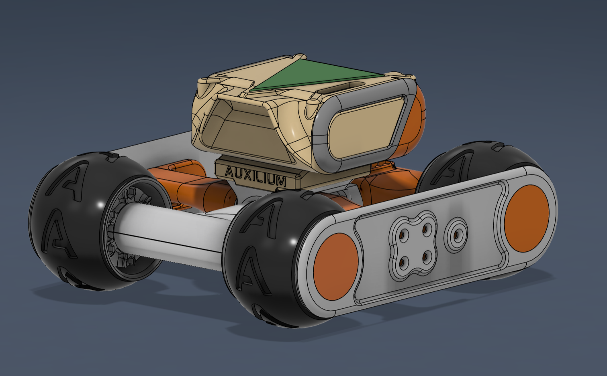
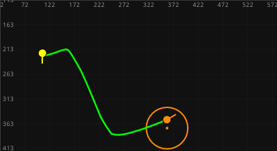
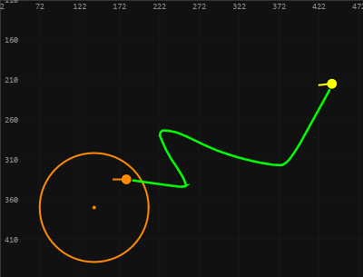
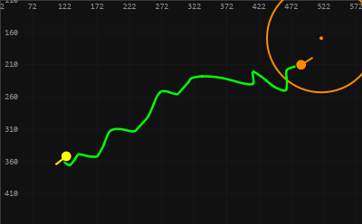

# AUX-ROBOT-4x4 — Автономный робот с визуальной одометрией

[](https://python.org)
[](https://www.espressif.com)
[](LICENSE)

Проект четырёхколёсного робота на базе **ESP32**, способного автономно перемещаться по заданной траектории. Позиционирование осуществляется с помощью **компьютерного зрения** — веб-камера отслеживает специальный маркер на корпусе.

<p align="center">
  
</p>

<p align="center">
  
</p>

---

## 🔧 Возможности

- **Ручное управление** с клавиатуры (WASD)
- **Автономный режим** следования по траектории
- **Turn-and-Go** стратегия движения (поворот на месте → прямолинейное движение)
- **Пропорциональный регулятор** с настройкой через GUI-ползунки в реальном времени
- **Визуальная одометрия** — определение позы по зелёному треугольному маркеру
- **Фильтрация ложных детекций** по рабочей зоне
- **Сохранение графиков** траекторий в PNG
- **Веб-интерфейс** на FastAPI + WebSocket
- **Лаунчер** для запуска в один клик с автооткрытием браузера
- **Сборка в `.exe`** через PyInstaller для Windows

---

## 📁 Структура проекта
```
bobr_wifi/
├── client/ # Управляющий код (Python)
   ├── proxy.py # FastAPI-сервер, WebSocket ↔ TCP прокси
   ├── planner.py # Планировщик траекторий (Turn-and-Go)
   ├── visual_odometry.py # Визуальная одометрия (OpenCV)
   ├── config.py # Единый конфигурационный файл
   ├── launcher.py # Лаунчер (Flask) — точка входа
   ├── static/ # Веб-интерфейс
   │ ├── index.html
   │ ├── css/style.css
   │ └── js/main.js
   ├── graphs/ # Сохранённые графики траекторий
   └── requirements.txt # Python-зависимости
```

---


## 🚀 Быстрый старт

### 1. Установите Python 3.10+ и зависимости

```
cd client
pip install -r requirements.txt
```
2. Запустите лаунчер

```
python launcher.py
```
В браузере откроется страница лаунчера. Нажмите «Подключиться» — запустится прокси, через несколько секунд появится кнопка «Открыть панель управления».
3. Подключитесь к роботу

Подключите компьютер к Wi‑Fi сети BOBR_4x4 (пароль: 12345678)

Включите ESP32 на роботе

4. Начните работу

Вкладка «Ручное» — управление клавиатурой или тачскрином

Вкладка «Авто» — откройте камеру, нарисуйте траекторию мышью в окне одометрии, нажмите «Старт»


### 📋 Настройка параметров конфигурации (`client/config.py`)

| Параметр | По умолчанию | Описание |
|----------|-------------|----------|
| **Сеть** | | |
| `HOST` | `192.168.4.1` | IP-адрес ESP32 |
| `PORT` | `8888` | TCP-порт команд ESP32 |
| `PROXY_HOST` | `0.0.0.0` | Адрес FastAPI (все интерфейсы) |
| `PROXY_PORT` | `8000` | Порт веб-интерфейса |
| `TELEMETRY_INTERVAL` | `0.5` | Интервал опроса телеметрии (с) |
| **ESP32 / Моторы** | | |
| `MAX_PWM` | `1023` | Максимальный ШИМ (10 бит) |
| `MIN_PWM` | `300` | Минимальный ШИМ трогания с места |
| `MOTOR_REMAP` | `[3,2,1,0]` | Маппинг клиентских индексов → физические моторы |
| `MOTOR_INVERT` | `[False,True,True,False]` | Инверсия направления (до ремапа) |
| **Камера** | | |
| `CAMERA_PARAMS["source"]` | `1` | ID камеры (0 – встроенная, 1 – USB) |
| `CAMERA_PARAMS["fps"]` | `30` | Частота кадров |
| `CAMERA_PARAMS["resolution"]` | `(640, 480)` | Разрешение кадра |
| **Детекция маркера** | | |
| `DETECTION_PARAMS["color_lower"]` | `[25, 107, 110]` | Нижняя граница HSV (зелёный) |
| `DETECTION_PARAMS["color_upper"]` | `[85, 255, 255]` | Верхняя граница HSV (зелёный) |
| `min_area` | `80` | Минимальная площадь контура (px²) |
| `min_triangle_ratio` | `1.10` | Минимальное отношение сторон bounding boмальный ШИМ трогания с места |
| `MOTOR_REMAP` | `[3,2,1,0]` | Маппинг клиентских индексов → физические моторы |
| `MOTOR_INVERT` | `[False,True,True,False]` | Инверсия направления (до ремапа) |
| **Камера** | | |
| `CAMERA_PARAMS["source"]` | `1` | ID камеры (0 – встроенная, 1 – USB) |
| `CAMERA_PARAMS["fps"]` | `30` | Частота кадров |
| `CAMERA_PARAMS["resolution"]` | `(640, 480)` | Разрешение кадра |
| **Детекция маркера** | | |
| `DETECTION_PARAMS["color_lower"]` | `[25, 107, 110]` | Нижняя граница HSV (зелёный) |
| `DETECTION_PARAMS["color_upper"]` | `[85, 255, 255]` | Верхняя граница HSV (зелёный) |
| `min_area` | `80` | Минимальная площадь контура (px²) |
| `min_triangle_ratio` | `1.10` | Минимальное отношение сторон bounding box |
| `morph_kernel` | `3` | Размер ядра морфологических операций |
| `alpha_pos` | `0.40` | Сглаживание координат центра |
| `alpha_theta` | `0.30` | Сглаживание угла |
| `alpha_dir` | `0.5` | Сглаживание вектора направления (нос–центр) |
| `motion_lock_px` | `6.0` | Порог смещения для подавления ложного переворота носа |
| **Планировщик** | | |
| `PLANNER_PARAMS["dt"]` | `0.05` | Шаг цикла управления (20 Гц) |
| `SAFETY["pose_timeout"]` | `0.5` | Таймаут свежести позы → остановка (с) |
| `MARKER_OFFSET_PX` | `(0, 0)` | Смещение центра маркера от центра вращения (dx, dy) |
| `ARRIVAL_RADIUS_PX` | `30` | Радиус «точка достигнута» (px) |
| `SLOWDOWN_RADIUS_PX` | `80` | Начало плавного торможения (px) |
| **Регулятор Turn-and-Go (ползунки)** | | |
| `TURN_SPEED` | `0.4` | Макс. скорость поворота на месте (доля ШИМ) |
| `TURN_ACCURACY_DEG` | `5.0` | Точность поворота (градусы) |
| `KP_TURN` | `2.0` | Пропорциональный коэффициент поворота |
| `DRIVE_CORRECTION` | `0.15` | Макс. сила подруливания при движении |
| `DRIVE_CORRECTION_THRESH` | `5.0` | Порог ошибки курса для подруливания (градусы) |


## Окно визуальной одометрии: docs/odometry_window.png
<p align="center">
  
</p>

## Веб-интерфейс:
<p align="center">
  
</p>

## График траектории: 
<div style="display: flex; justify-content: center; align-items: center; gap: 15px; flex-wrap: wrap;">
  
  
  
</div>


